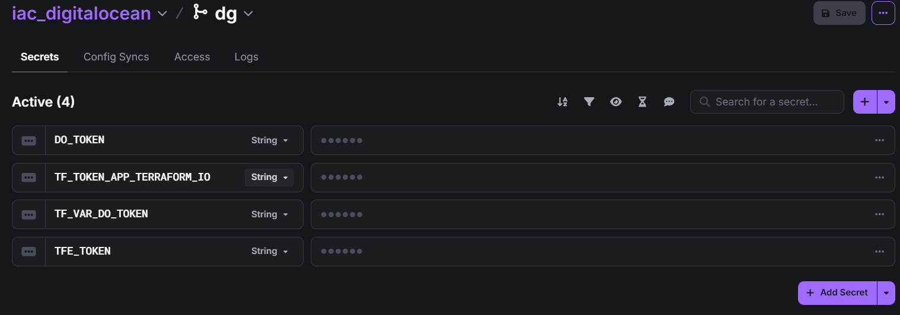
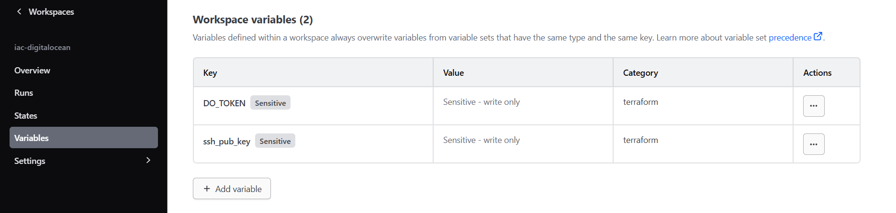

# DigitalOcean Droplet with Terraform Cloud & Doppler

This project uses [Terraform](https://www.terraform.io/) to provision infrastructure on [DigitalOcean](https://www.digitalocean.com/), with remote state managed in [Terraform Cloud](https://developer.hashicorp.com/terraform/cloud-docs) and secrets managed using [Doppler](https://www.doppler.com/).

It follows the structure and recommendations from [ROADMAP.sh: Infrastructure as Code on DigitalOcean](https://roadmap.sh/projects/iac-digitalocean).


This project uses [Terraform](https://www.terraform.io/) to provision a DigitalOcean Droplet. It leverages [Terraform Cloud](https://developer.hashicorp.com/terraform/cloud-docs) for state management and [Doppler](https://www.doppler.com/) for secrets management.

## Tools Used

- [Terraform](https://www.terraform.io/)
- [Terraform Cloud](https://developer.hashicorp.com/terraform/cloud-docs)
- [DigitalOcean](https://www.digitalocean.com/)
- [Doppler](https://www.doppler.com/) – secret management

## Steps to reproduce

### 1. Prerequisites

Before you begin, make sure you have the following:

- [Terraform CLI](https://developer.hashicorp.com/terraform/downloads)
- [Doppler CLI](https://docs.doppler.com/docs/install-cli)
- A DigitalOcean account and API token
- A Terraform Cloud account

---

### 2. Set Up Doppler Secrets

Create a new project in Doppler and add the following secrets:



- `DO_TOKEN` – Your DigitalOcean API token  
- `TF_TOKEN_APP_TERRAFORM_IO` – Your Terraform Cloud API token  
- `TF_VAR_DO_TOKEN` – Same as `DO_TOKEN` (used by Terraform)  
- `TFE_TOKEN` – Another Terraform Cloud API token (used for authentication)

---

### 3. Set Up Variables in Terraform Cloud Workspace

In your Terraform Cloud workspace, add these variables:



- `ssh_pub_key` – Your public SSH key (used to access the Droplet)  
- `DO_TOKEN` – Your DigitalOcean API token (same as in Doppler)

---

### 4. Authenticate and Initialize

Run the following commands to authenticate with Doppler and initialize Terraform:

```bash
doppler login
doppler setup
doppler run -- terraform init
doppler run -- terraform apply
```

## Important notes
- Ensure your SSH key is added to DigitalOcean.
- Workspace must be configured in Terraform Cloud before running `apply`.
- Never commit your tokens or secrets to the repo. Always use Doppler or environment variables to handle sensitive data.
